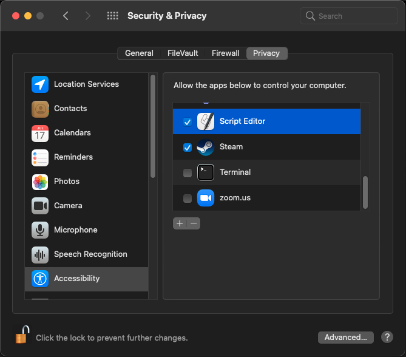

# desktop-image-switcher

~~NOTE: this stopped working in the latest update from Apple, MacOS 11.4. So I am archiving this application. Feel free to email me if you have any ideas.~~
NOTE: This was still working for me on macOS Big Sur 11.4. I did have to allow Apple Script Editor accessibility permissions to allow the script to send keystrokes. I've since added this screenshot to the screenshots folder and updated the documentation below.

MacOS utility to change desktop background image for all virtual desktops and monitors

## Installation

To install system-wide to `/usr/local/bin`:

```
git clone https://github.com/GabrielDougherty/desktop-image-switcher.git
cd desktop-image-switcher
sudo make install
```

Or if you want, just run `chmod +x desktop-image-switcher` and put it where ever you like.

## Uninstall

```
cd desktop-image-switcher
sudo make uninstall
```

## Usage

To set the image for all three desktops to Peak:

```
desktop-image-switcher "/System/Library/Desktop Pictures/Peak.heic" 3
```

The first argument is the image to set, the second argument is the number of desktops. If you don't specify a number of desktops, desktop-image-switcher will default to 5.

The first time you run the utility, you will be prompted to allow the terminal emulator to control your computer:


This is because of my implementation approach of cycling through the desktops by sending Ctrl+Arrow keys. Click Ok then add your Terminal or iTerm as well as adding Apple's Script Editor to the list of allowed applications:




If the prompt fails for some reason, you can add your terminal emulator to the list at `Security and Privacy -> Accessiblity -> Allow the apps below to control your computer`. [Apple support article](https://support.apple.com/guide/mac-help/allow-accessibility-apps-to-access-your-mac-mh43185/mac)

## See Also

I wrote a blog post about my debugging process leading up to creation of this tool: https://gabrieldougherty.com/posts/macos-change-desktop-background-image/
