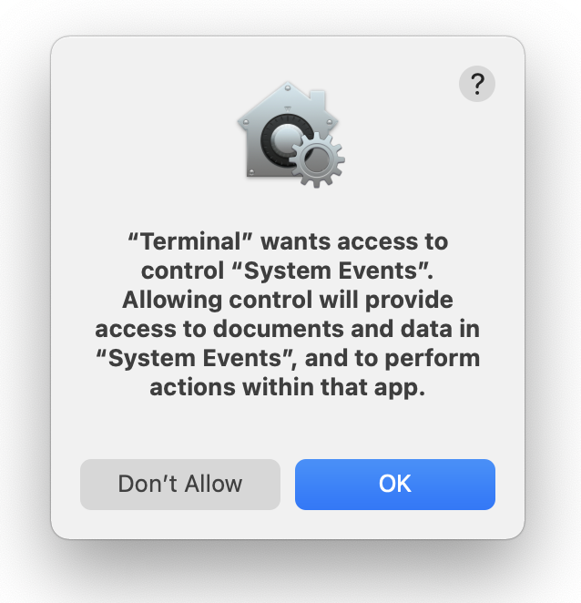
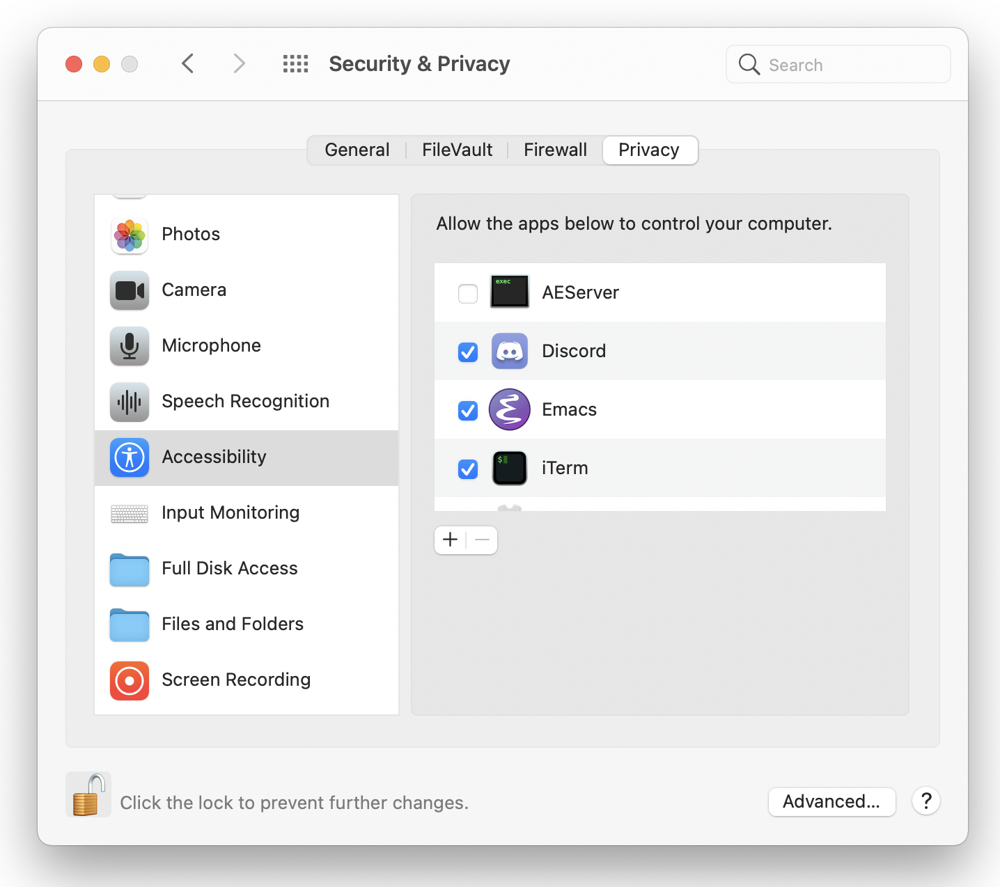

# desktop-image-switcher

MacOS utility to change desktop background image for all desktops

## Installation

To install system-wide to `/usr/local/bin`:

```
git clone https://github.com/GabrielDougherty/desktop-image-switcher.git
cd desktop-image-switcher
sudo make install
```

Or if you want, just run `chmod +x desktop-image-switcher` and put it where ever you like.

## Uninstall

```
cd desktop-image-switcher
sudo make uninstall
```

## Usage

To set the image for all three desktops to Peak:

```
desktop-image-switcher "/System/Library/Desktop Pictures/Peak.heic" 3
```

The first argument is the image to set, the second argument is the number of desktops. If you don't specify a number of desktops, desktop-image-switcher will default to 5.

The first time you run the utility, you will be prompted to allow the terminal emulator to control your computer:



This is because of my implementation approach of cycling through the desktops by sending Ctrl+Arrow keys. Click Ok then add your Terminal or iTerm to the list of allowed applications:



If the prompt fails for some reason, you can add your terminal emulator to the list at `Security and Privacy -> Accessiblity -> Allow the apps below to control your computer`. [Apple support article](https://support.apple.com/guide/mac-help/allow-accessibility-apps-to-access-your-mac-mh43185/mac)

## See Also

I wrote a blog post about my debugging process leading up to creation of this tool: https://gabrieldougherty.com/posts/macos-change-desktop-background-image/